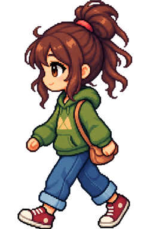
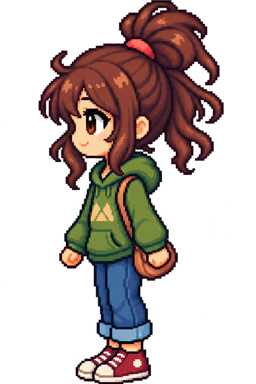
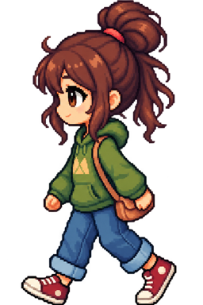

## PREVIEW

### Autonomous movement

## My Desktop Companion - Technical Prototype // v0.0.1

" A tiny life is happening on your desktop "

My Desktop Companion is a little side project that was originally made as a way to practice my coding abilities in JavaScript ; 
but the idea eventually evolved in a full concept for some sort of very liberal 'videogaming' experience.

MDC goal is to simulate the autonomous life of a small character, on the screen of the user, and to give the illusion that this
small character's behaviour is fully independant. I achieved this by using a random number generation method for this first 
iteration of the project, which mainly consist of the character moving by what looks like her own will and volition.

Prototype scope // Autonomous resident behaviour
Currently implemented :
- Idle & Walking states
- Autonomous movement
- Randomized destinations
- Random Idle duration
- Direction-aware animation
- Mirrored Sprites

Built with HTML + CSS + JavaScript
with AI-assisted coding, debugging and sprite generation using ChatGPT 

## LICENCE

Copyright 2026 © Jean Barthès. All rights reserved.

This project is publicly available for portfolio and demonstration purposes.
No permission is granted to copy, modify, distribute or use the source code without prior authorization.
